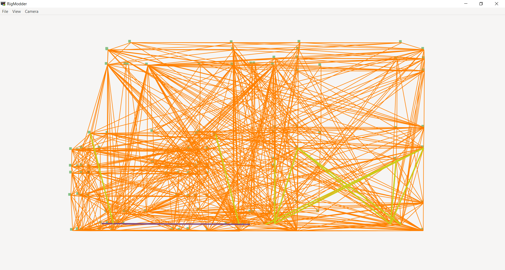

# RigModder
For Rigs of Rods, it edits and maybe visualizes objects attached to nodes. Such as flares.

### App Preview

- With a sample box that comes with this repo *now with actual 3d perspective projection*:

- ~~With actual vehicle~~:

- With an actual vehicle that can *now be rendered in 3d!*

### Please Note:
This software is still under development and I will not actually release it or put it into beta just yet. As this is an okay functioning program, you are more than welcome to test it out.

### How to run the software itself.

**There is no way to run the software with one click. As well with installing things with it yet.**

What you need to do by steps:

1. Install ruby 2.7.5+ with the devkit from the Ruby download page. (**NOT** ruby without the devkit)
1. Install gtk3 as a ruby gem like this: `gem install gtk3`
	- **Please note if you're on Windows, you are going to have to start "Command Prompt with Ruby" shortcut that came with ruby.
	- If it installation doesn't work as of read/write permissions, 
		- Use `sudo` on Linux
		- Or if your'e on Windows, try running the Command Prompt with Ruby with admin privileges.
1. After the installation of the `gtk3` ruby gem, run the software like this:
	- On Windows, press Win + R, then type in ``cmd``
		- Please note that with Linux platforms, you have to load Terminal from their app menu.
	- On the command line via `cmd` or `bash`, type in `ruby rm-main.rb` to execute the app.

### Known Bugs and Perfromance Issues
**Please note that I have not been tought many algorithms for ~~mouse movement within the structure~~ (Already did this on my own), performance optimization and somewhat others. As these issues will mainly relate to these topics.** As you know, I've tought myself basic code via videos and websites.

- Takes a minute or so to load after pressing the open button on the file selector which is shown here:

### Program Features
The features of this software I'm thinking about implementing are the following:

- The features currently being worked on:
	1. ~~Shocks~~ ***(Finished this one)***
	1. ~~Visual render in 3D~~ ***(Finished this one)***
	1. Flare positioning <- **(I am currently working on this feature!)**

- **Note about 2d perspective selections**
	I have to remove the camera menu that selects the 2d perspective projections due to a problem with the GTK signals handling some instance variables based off the selections. (In other words, cant find an idea for an algorithm to make this feature work.) *BUT,* I may put them back if I or anyone else in the repo comes up with an idea to fix or put up an algorithm for this.

**UPDATE**
- What will be next thing to work on (**In Order**):
	1. Wheels
	
- What I am thinking about implementing soon:
	- Implementing ways to edit the truck itself with visualization.