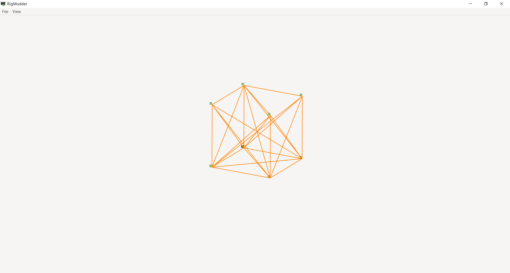
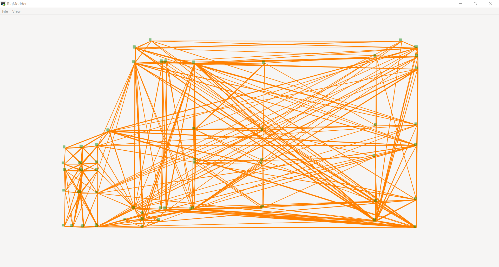
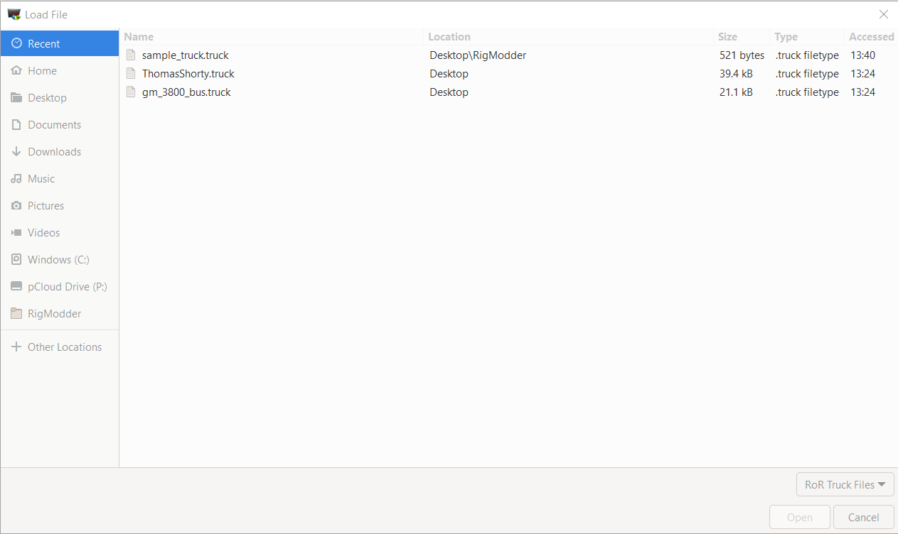

# RigModder
For Rigs of Rods, it edits and maybe visualizes objects attached to nodes. Such as flares.

### App Preview

- With a sample box that comes with this repo:

- With actual vehicle:

### Please Note:
This software is still under development and I will not actually release it or put it into beta just yet. As this is an okay functioning program, you are more than welcome to test it out.

### How to run the software itself.

**There is no way to run the software with one click. As well with installing things with it yet.**

What you need to do by steps:

1. Install ruby 2.7.5+ with the devkit from the Ruby download page. (**NOT** ruby without the devkit)
1. Install gtk3 as a ruby gem like this: `gem install gtk3`
	- **Please note if you're on Windows, you are going to have to start "Command Prompt with Ruby" shortcut that came with ruby.
	- If it installation doesn't work as of read/write permissions, 
		- Use `sudo` on Linux
		- Or if your'e on Windows, try running the Command Prompt with Ruby with admin privileges.
1. After the installation of the `gtk3` ruby gem, run the software like this:
	- On Windows, press Win + R, then type in ``cmd``
		- Please note that with Linux platforms, you have to load Terminal from their app menu.
	- On the command line via `cmd` or `bash`, type in `ruby viewer.rb` to execute the app.

### Known Bugs and Perfromance Issues
**Please note that I have not been tought many algorithms for mouse movement within the structure, performance optimization and somewhat others. As these issues will mainly relate to these topics.** As you know, I've tought myself basic code via videos and websites.

- Takes a minute or so to load after pressing the open button on the file selector which is shown here:

- Dragging the node/beam structure on the app can be difficult.
	- This can be when hold clicking, it takes it to the right path of where the cursor is coming from. *Although,* it does not recognize where the cursor is located exactly. Meaning it could be anyhwere and when clicked, it will directly come to where the cursor actually is. **For example:** The structure is on the left side of the canvas, when the cursor is on the right, if its clicked there, the structure will go right to where the cursor is.

- The structure has an issue with centering to the interface
	- The graphics library being used in this software, known as "Cairo", only recognizes translation for the whole sketch. When I programmed something for the nodes and beams themselves, it worsened perfromance of the application. Using its built in translation was the only key to make it better.

**This is all the issues I can think of as of now. If you find more, let me know on Discord at shinymodman#0114.**

### Program Features
The features of this software I'm thinking about implementing are the following:

- The features being worked on:
	- Interface enhancements.

**UPDATE**
- What will be next thing to work on (**In Order**):
	1. ~~Hydros (Hyrdraulics)~~ (Already finished this one)
	1. Shocks
	1. Wheels
	1. Flare positioning.
**UPDATE**
	
- What I am thinking about implementing soon:
	- Implementing ways to edit the truck itself with visualization.